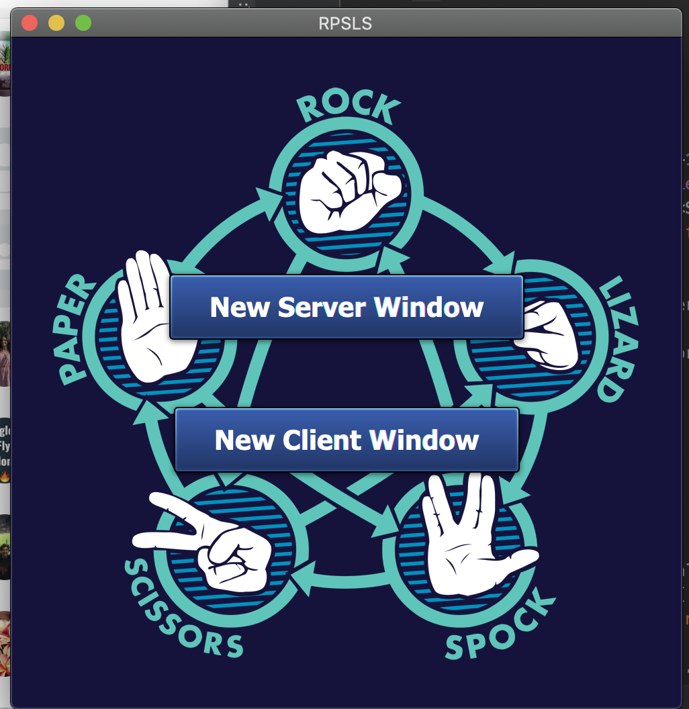

# Rock-Paper-Scissors-Lizard-Spock
This is a GUI game written in Java using the JavaFX library. The game is played with a server and 2 clients. Both the server and clients have their own GUI. Clients send in their choices by clicking on an image representing either rock, paper, scissors, lizard or Spock. The server determines the winner and sends the result back to the clients. The server pauses the game when a client exits.

# The game is played as follows:

Start up the game you should see scene below.

